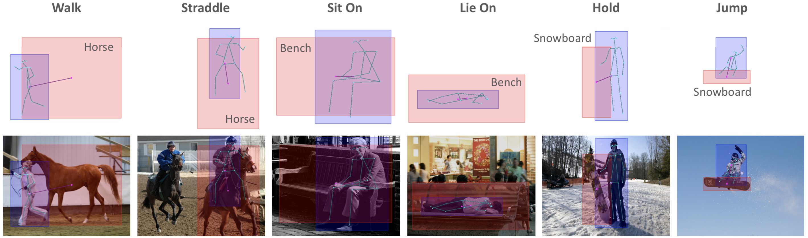
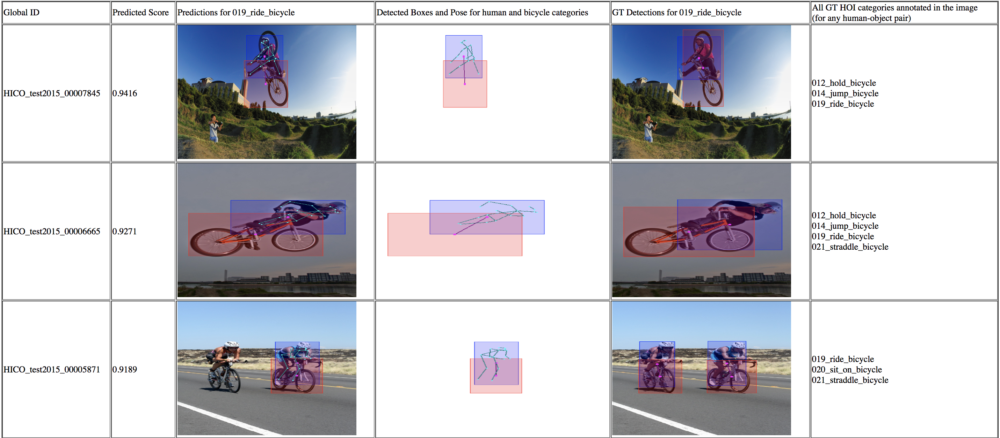
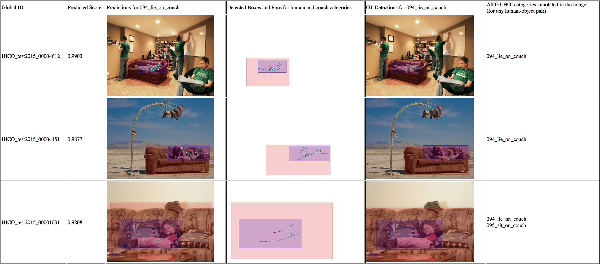
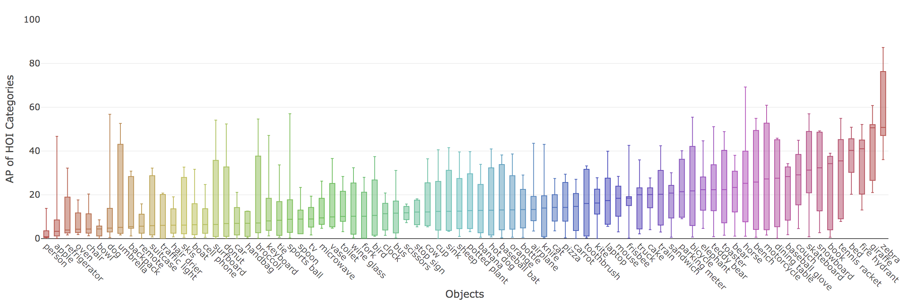
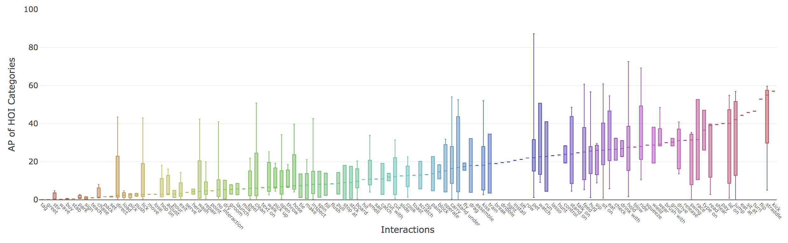

# No-Frills Human-Object Interaction Detection: Factorization, Layout Encodings, and Training Techniques
By [Tanmay Gupta](http://tanmaygupta.info), [Alexander Schwing](http://alexander-schwing.de), and [Derek Hoiem](http://dhoiem.cs.illinois.edu)

<p align="center">
    
</p>

# Content
- [Overview](#overview)
- [Requirements](#requirements)
- [Setup](#setup)
- [Download the HICO-Det dataset](#download-the-hico-det-dataset)
- [Process HICO-Det files](#process-hico-det-files)
- [Run Object Detector (or download the detections we provide)](#run-object-detector-or-download-the-detections-we-provide)
- [Run Human Pose Detector (or download the poses we provide)](#run-human-pose-detector-or-download-the-poses-we-provide)
- [Train HOI classifier](#train-hoi-classifier)
- [Evaluate Model](#evaluate-model)
- [Pretrained model](#pretrained-model)

# Overview
This repository provides code to train and evaluate an HOI Detection model (implemented in Pytorch) that demonstrates strong performance on the challenging HICO-Det benchmark...that too without frills!

**Why do we call it a no-frills model?**

We make several simplifications over existing approaches while achieving better performance owing to our choice of factorization, direct encoding and scoring of layout, and improved training techniques. Here are the key simplifications:

- Our model encodes appearance only using features extracted by an off-the-shelf object detector (Faster-RCNN pretrained on MS-COCO)
- We only use simple hand coded layout encodings constructed from detected bounding boxes and human pose keypoints (pretrained OpenPose)
- We use a fairly modest network architecture with light-weight multi-layer perceptrons (2-3 fully-connected layers) operating on the appearance and layout features mentioned above
- No Mixture-Density Network [2] or CNN for encoding Interaction Patterns [1]
- No multi-task learning [2]
- No fine-tuning object/pose detector [2]
- No attention mechanisms for modeling context [3]
- No message-passing over graphs [4]

**Available on Arxiv:** [https://arxiv.org/abs/1811.05967](https://arxiv.org/abs/1811.05967)

**BibTex:**
```
@article{gupta2018nofrills,
  title={No-Frills Human-Object Interaction Detection: Factorization, Layout Encodings, and Training Techniques},
  author={Gupta, Tanmay and Schwing, Alexander and Hoiem, Derek},
  journal={arXiv preprint arXiv:1811.05967},
  year={2018}
}
```

**References:**

[1] Chao, Y., Liu, Y., Liu, X., Zeng, H., & Deng, J. (2018). Learning to Detect Human-Object Interactions. 2018 IEEE Winter Conference on Applications of Computer Vision (WACV), 381-389.

[2] Gkioxari, G., Girshick, R.B., Dollár, P., & He, K. (2018). Detecting and Recognizing Human-Object Interactions. 2018 IEEE/CVF Conference on Computer Vision and Pattern Recognition, 8359-8367.

[3] Gao, C., Zou, Y., & Huang, J. (2018). iCAN: Instance-Centric Attention Network for Human-Object Interaction Detection. BMVC.

[4] Qi, S., Wang, W., Jia, B., Shen, J., & Zhu, S. (2018). Learning Human-Object Interactions by Graph Parsing Neural Networks. ECCV.

# Requirements

All dependencies will be installed in a python3 virtual environment. 

## Step 1: Create a python virtual environment

```
virtualenv -p python3.6 <path_to_new_virtual_env>
```

## Step 2: Activate the environment
```
source <path_to_new_virtual_env>/bin/activate
```

## Step 3: Install the dependencies

Here are the main requirements: 
- python 3.6.3
- pytorch 0.3.1
- numpy 1.14.2
- tqdm 4.23.0
- scipy 1.0.1
- scikit-image 0.13.1
- scikit-learn 0.19.1
- h5py 2.7.1
- plotly 2.5.1
- tensorboard-logger 0.1.0
- tensorflow 1.7.0 (cpu version works; required only for viewing logged data on tensorboard)

Most of these can be installed with pip. There might be other dependencies which could be installed when prompted. Please check `pip_freeze_dump.txt` for version numbers before proceeding to install. Note that this txt file lists a lot more packages than needed (all packages installed in my virtual environment).  

**Important:** This repository supports Pytorch 0.3.1 and is not compatible with version 0.4 or higher because of various breaking changes introduced in these versions like unification of Tensor and Variable, Scalar Tensors etc. See [Pytorch Migration Guide](https://pytorch.org/blog/pytorch-0_4_0-migration-guide/) for details if you would like to port the implementation to a newer version of Pytorch. 

# Setup

We will be executing all commands inside the root directory (`.../no_frills_hoi_det/`) that was created when you cloned the repository. 

To begin, we will create a directory in the root directory called `data_symlinks` that would contain symlinks to any data to be used or produced by our code. Specifically we will create 3 symlinks:
- `hico_clean` -> directory where you downloaded HICO-Det dataset
- `hico_processed` -> directory where you want to store processed data required for training/evaluating models
- `hico_exp` -> directory where you want to store outputs of model training and evaluation

Creating these symlinks is useful if your hardware setup constrains where you keep your data. For example, if you want to store the dataset on the local drives, and code, processed files, and experiment data on the NFS to be shared across multiple servers


```
mkdir data_symlinks
cd data_symlinks
ln -s <path to hico_clean> ./hico_clean
ln -s <path to hico_processed> ./hico_processed
ln -s <path to hico_exp> ./hico_exp
```

If executed correctly, `ls -l data_symlinks` in the root directory should show something like:
```
hico_clean -> /data/tanmay/hico/hico_det_clean_20160224
hico_exp -> /home/nfs/tgupta6/Code/hoi_det_data/hico_exp
hico_processed -> /home/nfs/tgupta6/Code/hoi_det_data/hico_processed
```

# Download the HICO-Det dataset
We will now download the required data from the [HICO-Det website](http://www-personal.umich.edu/~ywchao/hico/) to `hico_clean`. Here are the links to all the files (version 0160224) you would need to download
- [Images and Annotations](https://drive.google.com/open?id=1QZcJmGVlF9f4h-XLWe9Gkmnmj2z1gSnk) (.tar.gz)
- [List of HOIs](https://drive.google.com/open?id=1ipvRTUF2zpOlHHqzbEb29iwscizoM1CK) (.txt)
- [List of Verbs](https://drive.google.com/open?id=1EeHNHuYyJI-qqDk_-5nay7Mb07tzZLsl) (.txt)
- [List of Objects](https://drive.google.com/open?id=1geCHW-yukOnEPjkiD9n9N5rWGczpzX4p) (.txt)

Extract the images and annotations file which will be download as a tar.gz file using
```
tar xvzf <path to tar.gz file> -C <path to hico_clean directory>
```
Here `-C` flag specifies the target location where the files will be extracted.

After this step output of `ls -l data_symlinks/hico_clean` should look like
```
anno_bbox.mat
anno.mat
hico_list_hoi.txt
hico_list_obj.txt
hico_list_vb.txt
images
README
tools
```
# Process HICO-Det files
The HICO-Det dataset consists of images and annotations stored in the form of .mat and .txt files. Run the following command to quickly convert this data into easy to understand json files which will be written to `hico_processed` directory
```
bash data/hico/process.sh
```
In addition, the `process.sh` performs the following functions:
- It calls `data/hico/split_ids.py` which separates sample ids into train, val, train_val (union of train and val), and test sets.
- It executes `data/hico/hoi_cls_count.py` which counts number of training samples for each HOI category

The splits are needed for both training and evaluation. Class counts are needed only for evaluation to compute mAP of group of HOI classes created based on number of available training examples.

# Run Object Detector (or download the detections we provide)

## Download

- Download [faster_rcnn_boxes.tar.gz](https://drive.google.com/file/d/1DdzvwSllYenT5Jt4DIu52mGG3uLgXX42/view?usp=sharing) to `hico_processed` directory
- Extract the file in the `hico_processed` directory
    ```
    cd <path to hico_processed>
    tar -xvzf faster_rcnn_boxes.tar.gz -C ./
    rm faster_rcnn_boxes.tar.gz
    cd <path to root>
    ```
- Write Faster-RCNN features to an hdf5 file
    ```
    python -m exp.hoi_classifier.data.write_faster_rcnn_feats_to_hdf5
    ```

## Create your own

### Step 1: Prepare data for running faster-rcnn
```
python -m exp.detect_coco_objects.run --exp exp_detect_coco_objects_in_hico
```
This creates `faster_rcnn_im_in_out.json` file in `hico_exp/detect_coco_objects_in_hico` which specifies paths to the images on which to run the detector and the paths to the target location where the results would be saved. 

For each image with unique <global_id> the object detector writes the following to `hico_processed/faster_rcnn_boxes`:
- <global_id>_scores.npy
- <global_id>_boxes.npy
- <global_id>_fc7.npy
- <global_id>_nms_keep_indices.npy

### Step 2: Run faster-rcnn

This step requires `faster_rcnn_im_in_out.json` file created in the previous step. I have created a fork of a popular Faster-RCNN pytorch implementation. This fork includes a script that takes the json file and writes the outputs to `hico_processed` in the required format. Please follow installation and execution instructions at [https://github.com/BigRedT/pytorch-faster-rcnn](https://github.com/BigRedT/pytorch-faster-rcnn)

Once the faster-rcnn features are saved, we will write them all to a single hdf5 file using:
```
python -m exp.hoi_classifier.data.write_faster_rcnn_feats_to_hdf5
```

### Step 3: Select candidate boxes for each object category from all predictions

For each image, Faster-RCNN predicts class scores (for 80 COCO classes) and box regression offsets (per class) for upto 300 regions. In this step, for each COCO class, we select upto 10 high confidence predictions per class after non-max suppression by running the following:
```
python -m exp.detect_coco_objects.run --exp exp_select_and_evaluate_confident_boxes_in_hico
```

This will create an hdf5 file called `selected_coco_cls_dets.h5py` in `hico_exp/select_confident_boxes_in_hico` directory. More details about the structure of this file can be found [here](docs/selected_coco_cls_dets.md).

The above command also performs a recall based evaluation of the object detections to see what fraction of ground truth human and object annotations are recalled by these predictions. These stats are written to the following files in the same directory:
- `eval_stats_boxes.json`: All selected detections irrespective of the predicted class are used for computing recall numbers.
- `eval_stats_boxes_labels.json`: Only selected detections for the corresponding class are used for computing recall. 

As shown in the table below, our run resulted on average 6 human and 94 object (all categories except human) candidate detections per image. `eval_stats_boxes_labels.json` shows recall of the *labelled* detections (for example only the 6 human candidates would be used as predictions to compute human recall), where as `eval_stats_boxes.json` shows recall values if all 100 (6+94) detections were considered as predictions for every human/object category irrespective of the labels predicted by faster-rcnn. Let us refer to this case as *unlabelled*. The idea is that using labels predicted by the detector helps prune out candidates to be examined for any HOI category by limiting box-pair candidates to those constructed from detections for human and the object category involved in the said HOI category. The significant reduction in candidates (and hence reduced computation for our model and likely false positives) is at the expense of a reasonable and expected drop in object recall due to detections missed by the object detector and our selection scheme. 

||Labelled|Unlabelled|
|:--|:------|:--------|
| Avg. Human Candidates | 6 | 100 (=6+94) |
| Avg. Object Candidates | 1.2 (=94/79) | 100 |
| Avg. Connection / Pair Candidates | 0.9 (=568/600) | 16.9 =(10122/600) |
| Human Recall | 86% | 89% |
| Object Recall | 70% | 86% |
| Connection / Pair Recall | 59% | 77% | 

# Run Human Pose Detector (or download the poses we provide)

## Download

- Download [human_pose.tar.gz](https://drive.google.com/file/d/1Y7NBgX8CeuAEqttUVRHJMb-9cXCJfIP6/view?usp=sharing) to `hico_processed` directory
- Extract the file in the `hico_processed` directory
    ```
    cd <path to hico_processed>
    tar -xvzf human_pose.tar.gz -C ./
    rm human_pose.tar.gz
    cd <path to root>
    ```

## Create your own

We will use OpenPose to extract human pose. We used the official implementation available at [https://github.com/CMU-Perceptual-Computing-Lab/openpose](https://github.com/CMU-Perceptual-Computing-Lab/openpose). We used the latest version of the master branch of OpenPose available at the time (`commit: f430a79`). The branch has moved ahead by several commits since then and we haven't tested the latest version (though I would assume it works too). 

To extract pose run the following replacing `<subset>` by `train2015` and `test2015`.

```
./build/examples/openpose/openpose.bin \
    --image_dir <path to hico_clean>/images/<subset>/ \
    --face \
    --hand \
    --write_json <path to hico_processed>/human_pose/<subset> \
    --display 0
```

# Train HOI classifier

## Step 1: Generate HOI candidates from object candidates and cache Box and Pose features
We provide a simple bash script for this:
```
bash exp/hoi_classifier/scripts/preprocess.sh
```
This generates the following files in `hico_exp/hoi_candidates` directory:
- `hoi_candidates_<subset>.hdf5` : Box pair candidates. More details [here](docs/hoi_candidates.md)
- `hoi_candidate_labels_<subset>.hdf5` : Binary labels for hoi candidates to be used during training
- `hoi_candidates_box_feats_<subset>.hdf5` : Cached Box features
- `hoi_candidates_pose_<subset>.hdf5` : Pose keypoints assigned to human bounding boxes
- `hoi_candidates_pose_feats_<subset>.hdf5` : Cached Pose features

## Step 2: Train the model

Modify flags in `exp/hoi_classifier/scripts/train.sh` as required and run:
```
bash bash exp/hoi_classifier/scripts/train.sh <GPU ID>
```
`<GPU ID>` specifies the GPU to use for training the model.

This creates a directory called `factors_rcnn_det_prob_appearance_boxes_and_object_label_human_pose` in `hico_exp/hoi_classifier`. The name of the directory is automatically constructed based on the factors used in this model. The factors are enabled using appropriate flags in the `train.sh` file. 

This directory is used to store the following:
- constants needed for running the experiment
    - data paths (`data_train/val_constants.json`)
    - model hyperparameters (`model_constants.json` and `model.txt`) 
    - training hyperparameters (`exp_constants.json`) 
- tensorboard log files (`log/`)
- model checkpoints (`models/`)

### View Tensorboard Logs
```
tensorboard --logdir=./data_symlinks/hico_exp/hoi_classifier
```

### Time and Memory
- The full model achieves best val set performance in about 30000 iterations in ~6hrs
- GPU memory usage is under 3 GB
- RAM utilization is under 1.5 GB

# Evaluate Model

## Step 1: Select the model to evaluate

The model can be selected based on the validation loss logged in tensorboard and is usually around 30000 iterations. Let us call the selected iteration `<MODEL NUM>`


## Step 2: Make predictions for the test set

```
bash exp/hoi_classifier/scripts/eval.sh <GPU ID> <MODEL NUM>
```

This generates a `pred_hoi_dets.hdf5` file. The structure of the file is detailed [here](docs/pred_hoi_dets.md)

## Step 3: Compute mAPs

This is done by the `compute_map.sh` script in `exp/hico_eval` directory. Update variable `EXP_NAME` to the one you want to evaluate and `MODEL_NUM` to the selected `<MODEL NUM>` and run
```
bash exp/hico_eval/compute_map.sh
```
`EXP_NAME` defaults to `factors_rcnn_det_prob_appearance_boxes_and_object_label_human_pose` which is the model trained with all factors. The APs for each HOI category and overall performance are stored in the experiment directory with a relative path that looks like `mAP_eval/test_<MODEL NUM>/mAP.json`

The mAP for the provided model for various category groups (based on number of training samples) are as follows:

|Model|Full|Rare|Non-Rare|0-9|10-49|50-99|100-499|500-999|1000-9999|
|:-|:-:|:-:|:-:|:-:|:-:|:-:|:-:|:-:|:-:|
|HO-RCNN [1]|7.81|5.37|8.54|-|-|-|-|-|-|
|InteractNet [2]|9.94|7.16|10.77|-|-|-|-|-|-|
|GPNN [4]|13.11|9.34|14.23|-|-|-|-|-|-|
|iCAN [3]|14.84|10.45|16.15|-|-|-|-|-|-|
|**No-Frills**|**17.07**|**11.5**|**18.74**|**11.5**|**11.63**|**14.57**|**21.85**|**25.42**|**41.54**|

## Step 4: Visualize 

### Top Ranking Detections

To visualize top ranking detections (as shown below) for each of the 600 HOI categories:
```
bash exp/hoi_classifier/scripts/visualize.sh <MODEL NUM>
```
This generates `vis/top_boxes_per_hoi_wo_inference/<hoi_id>_<verb>_<object>/` directory for each HOI inside the training experiment directory. Each such directory contains a few .png files and `index.html` that visualizes the .png files when opened in a browser.

#### Top ranking detections for `ride bike` (see `imgs/019_ride_bicycle`)


#### Top ranking detections for `lie on couch` (see `imgs/094_lie_on_couch`)


### Performance distribution

To visualize spread of performance across different interactions with the same object run:
```
python -m exp.hoi_classifier.vis.vis_interaction_aps_per_object
```



An interactive version of the plot is available at `imgs/interaction_aps_per_object.html`.


To visualize spread of performance across different objects for the same interaction run:
```
python -m exp.hoi_classifier.vis.vis_object_aps_per_interaction
```



An interactive version of the plot is available at `imgs/object_aps_per_interaction.html`.

# Pretrained model
- [trained_models](https://drive.google.com/drive/folders/1JVCYA_-ypYYsvNDiT8wThBs9ai_h7XOK?usp=sharing): This directory contains the selected checkpoint for our full model (with all factors). You may follow `exp/hoi_classifier/eval.py` script and the corresponding experiment launcher `exp_eval()` in `exp/hoi_classifier/run.py` to see how to load and use the trained model.  
- [top_boxes_per_hoi.zip](https://drive.google.com/file/d/1RXnkDfte5Bq8Q-Y81ZgRvG5Pod_LYIGL/view?usp=sharing): Top ranking detections visualized for all 600 HOI categories. Incredibly useful for identifying failure cases and improving the model!
